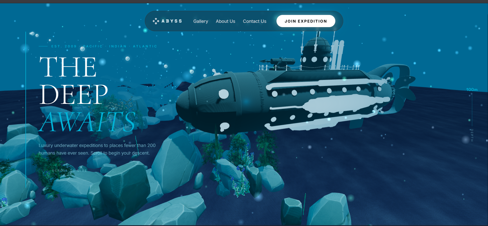
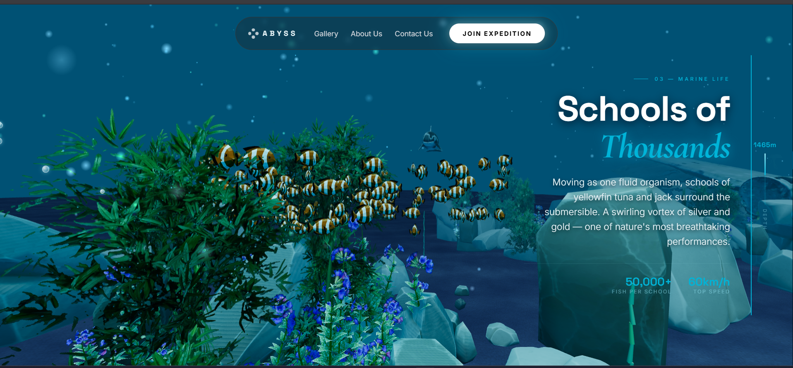
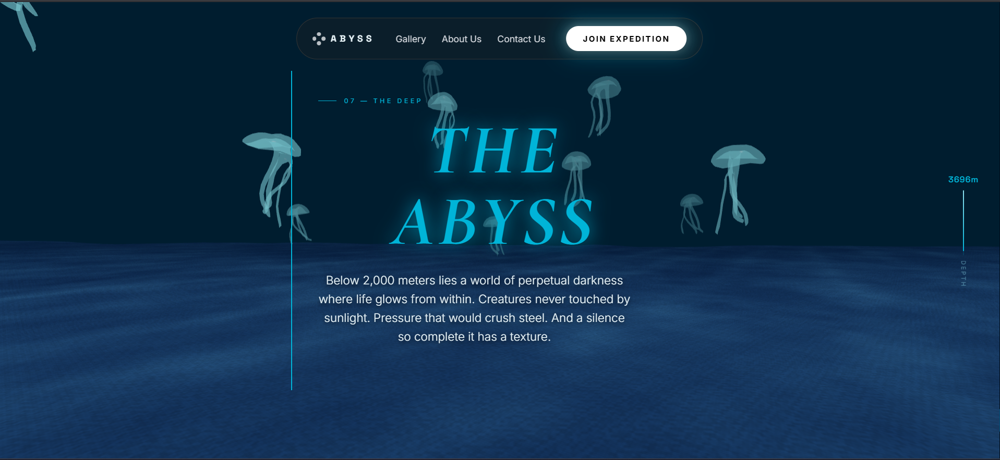
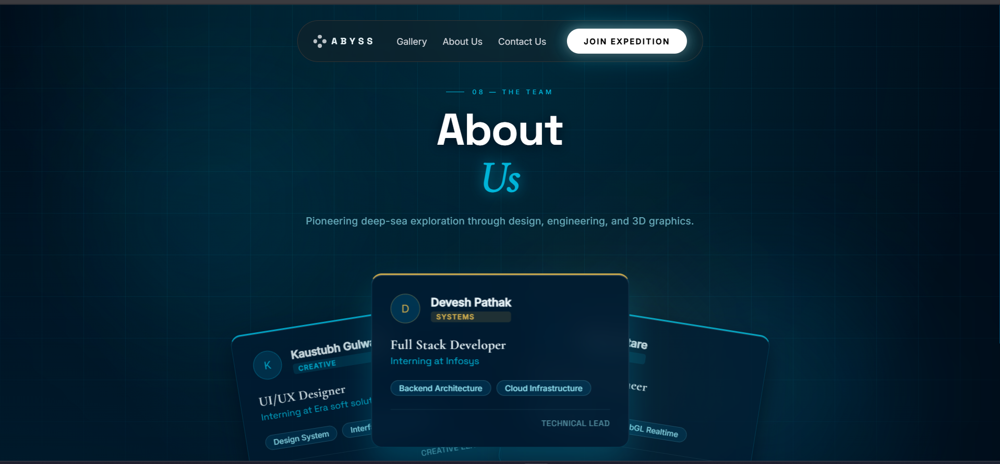
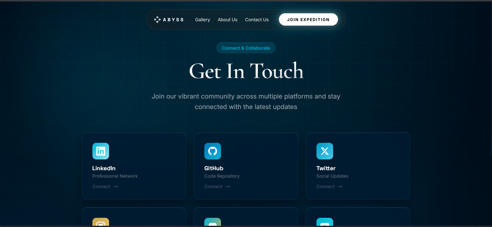

# 🌊 ABYSS — 3D Ocean Exploration Experience

[](https://hackoceanabyss3d.vercel.app/)
[](https://vitejs.dev/)
[](https://threejs.org/)
[](https://developer.mozilla.org/en-US/docs/Web/JavaScript)

🌐 **Live Deployment**: [https://hackoceanabyss3d.vercel.app/](https://hackoceanabyss3d.vercel.app/)

> **"An immersive, scroll-driven 3D web voyage that turns digital browsing into a cinematic deep-sea expedition."**

---

## 📸 Overview

**ABYSS** is a web-based 3D interactive exploration platform built with Three.js, WebGL, and Vite. Users scroll through 12 distinct oceanic depth milestones—descending from sunlight surface waters (`0m`) down to the pitch-black Mariana Trench (`3,800m`).

Along the journey, users encounter high-fidelity animated 3D GLTF models including research submersibles, dolphins, biomorphic jellyfish clusters, sunken aircraft wrecks, and instanced schooling fish, all framed by responsive glassmorphism UI overlays and bioluminescent cursor micro-interactions.

---

## 🖼️ Visual Showcase

| Home Hero & Submarine | Marine Ecosystem & Schools |
| :---: | :---: |
|  |  |

| The Abyssal Trench | Team & Technical Stack | Contact & Expedition Form |
| :---: | :---: | :---: |
|  |  |  |

---

## ✨ Key Features

- 🎥 **Cinematic Scroll-Driven 3D Camera Spline**: Binds the user's scroll directly to camera trajectory and focus targets (`lookAt`), creating an organic underwater dive with zero scroll lag.
- 🫧 **Interactive Cursor Particle Trail**: Every mouse movement generates glowing, translucent underwater bubbles with horizontal current drift and upward buoyancy.
- 🐬 **Dynamic Marine Fauna & Environment**:
  - **Research Submersibles** (`submarine.glb`): Detailed deep-sea exploration vessels.
  - **Ocean Cetaceans** (`dolphin.glb`): Animated dolphins swimming in the camera path.
  - **Bioluminescent Jellyfish Swarms**: Multi-tiered jellyfish clusters with sine-wave movement.
  - **Instanced Fish Schooling**: Over 150 instanced 3D fish (`fish.glb`) swimming in coordinated circular schooling patterns at 60 FPS.
  - **Sunken Seabed Relics**: Sunken plane wrecks (`plane.glb`), underwater rock formations (`rocks.glb`), and dynamic aquatic foliage (`plant02.glb`, `plant03.glb`).
- 🖼️ **3D Abyssal Media Gallery (`gallery.html`)**: An interactive 3D media card galaxy with OrbitControls, deep dark-blue canvas fog, glowing star particles, tilt effects, and modal detail views.
- 📋 **Ocean-Themed Expedition Modal**: Glassmorphism inquiry form featuring bioluminescent cyan focus glows, animated top accent bar, and high-contrast white CTA buttons.

---

## 🌟 Unique Selling Proposition (USP)

1. **Fluid 3D Web Storytelling**: Combines WebGL rendering with smooth scroll interpolation to turn educational marine biology metrics into an engaging experience.
2. **Hyper-Performant WebGL Architecture**: Uses instanced mesh rendering, soft shadow mapping, and tone mapping to achieve 60 FPS performance in standard web browsers.
3. **Immersive Micro-Interactions**: Ambient starfield background drift, bioluminescent cursor trails, and glassmorphism UI design.

---

## 🛠️ Tech Stack

- **3D Engine**: [Three.js](https://threejs.org/) (WebGL, GLTFLoader, OrbitControls, PCFSoftShadowMap, ACESFilmicToneMapping)
- **Animation & Scroll**: [Lenis](https://lenis.darkroom.engineering/) (Smooth Scroll), [GSAP](https://greensock.com/gsap/)
- **Frontend Architecture**: HTML5, Vanilla CSS3 (Custom Design System, Glassmorphism, Responsive Grid)
- **Build Tool**: [Vite](https://vitejs.dev/)
- **Deployment**: [Vercel](https://vercel.com/) (Multi-page rollup build configuration & `vercel.json` clean routing)

---

## 🚀 Getting Started Locally

### Prerequisites
- [Node.js](https://nodejs.org/) (v16.0 or higher)
- [npm](https://www.npmjs.com/)

### Installation

1. **Clone the repository**:
   ```bash
   git clone https://github.com/Omkar-SK/HackOcean.git
   cd HackOcean
   ```

2. **Install dependencies**:
   ```bash
   npm install
   ```

3. **Start the local development server**:
   ```bash
   npm run dev
   ```
   Open `http://localhost:3000` in your browser.

4. **Build for production**:
   ```bash
   npm run build
   ```

---

## 🌐 Deployment & Vercel Configuration

This project is configured for multi-page deployment on **Vercel** with Vite's Rollup build options:

- **`vite.config.js`**: Defines multi-page HTML inputs (`index.html`, `gallery.html`, `about.html`, `contact.html`).
- **`vercel.json`**: Configured with `cleanUrls` and routing rewrites for multi-page navigation.

---

## 🔮 Future Scope & Roadmap

- 🥽 **WebXR VR/AR Support**: Spatial computing mode for Apple Vision Pro & Meta Quest 3 headsets.
- 🔊 **3D Positional Audio**: Web Audio API spatial node graph for underwater sonar, whale acoustics, and ocean currents.
- 🧠 **AI Boids Fish Flocking**: Predator-prey behavior engine with dynamic collision avoidance.
- 📊 **Real-Time NOAA Data**: Streaming live global ocean temperature, salinity, and depth metrics.

---

## 👥 Team

- **Devesh Pathak** — *Full Stack Developer / Systems & Technical Lead* (Infosys Intern)
- **Omkar Katare** — *3D Graphics Engineer / Graphics Lead* (Opensoft Intern)

---

## 📄 License

This project was built for hackathon demonstration. All rights reserved.
